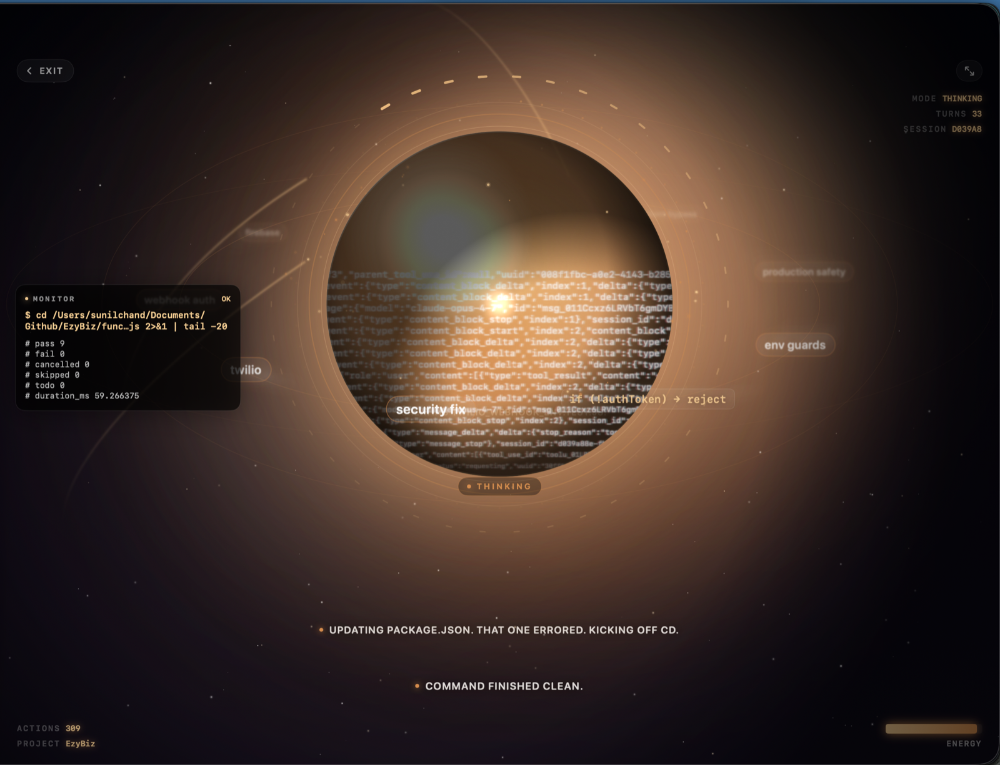

# Claudette

A native macOS front-end for [Claude Code](https://docs.claude.com/en/docs/claude-code) — the same agent, wrapped in a calm, video-like UI. Point it at any folder on your Mac and watch Claude work.



*Orb conversation mode: press any key to talk. The sphere refracts the actual Claude Code JSON stream inside; short "beats" narrate what Claude is doing right now; the MONITOR panel tails the current bash tool; idea satellites orbit the sphere with the tags Haiku pulled out of the turn.*

## Why

Claude Code is powerful but its CLI is a wall of text. Claudette turns each run into something you can *skim*:

- **Every tool call is a distinct visual beat.** Read, Edit, Bash, Grep, WebFetch — each shows up as its own card with an icon, a human sentence, a live status pill, and an expandable body.
- **Edits play like a video.** When Claude edits a file, the card zooms in and reveals a real inline diff with green additions and red deletions. Multi-edit changes are stacked into a single card.
- **A narrator strip** at the bottom of the chat tells you what Claude is doing *right now* — "Reading src/foo.ts", "Editing package.json", "Running: npm test" — so you never lose the thread while responses stream.
- **Prose is prose.** Assistant text renders as serif Markdown with proper spacing, code fences, lists, quotes and inline code.
- **The whole app breathes** — spring transitions on new cards, gentle pulses on running actions, no jitter, no cognitive tax.

## Requirements

- macOS 14 (Sonoma) or newer
- Xcode 15+ / Swift 5.9+
- Claude Code CLI installed (`brew install claude` or `npm i -g @anthropic-ai/claude-code`)
- Signed in with `claude auth` in Terminal at least once

## Build

```bash
./build.sh
open build/Claudette.app
```

Or drop it into `/Applications`:

```bash
cp -R build/Claudette.app /Applications/
```

## Anatomy of a chat

Each item in the timeline is one of:

| Kind             | Renders as                                                                                                     |
| ---------------- | -------------------------------------------------------------------------------------------------------------- |
| user message     | A right-aligned serif bubble                                                                                   |
| assistant text   | Left-aligned prose with Markdown, streaming dots while in flight                                               |
| thinking         | A collapsible "Thinking" line                                                                                  |
| **action card**  | Icon + title + status pill + `+adds −dels` chip, expands to reveal a diff, terminal card, or preformatted body |
| system notice    | A quiet info line                                                                                              |

### Action cards

Actions pair the `tool_use` event with its matching `tool_result` — you see one card per step, not two. Card styling by category:

- **Edit / MultiEdit** — auto-opens on completion with an LCS-based diff view (2-line context, added lines highlighted green, removed lines struck through in red).
- **Write** — same diff view against an empty original.
- **Bash** — terminal-style card with `$ command` on top and output below; error output tinted red.
- **Read** — file preview truncated to the first 24 lines.
- **Grep / Glob** — match list.
- **WebFetch** — URL + response body.
- **TodoWrite** — proper checklist with checkbox states.

Status pill goes from a pulsing "Working" → green "Done" → red "Error".

## Architecture

```
Sources/Claudette/
├── ClaudetteApp.swift           # @main + AppDelegate
├── Theme/Theme.swift            # design tokens
├── Models/
│   ├── Project.swift
│   └── TimelineItem.swift       # flat timeline: user/assistant/thinking/action/system
├── Services/
│   ├── ProjectStore.swift       # persists to ~/Library/Application Support/Claudette
│   └── ClaudeCLIService.swift   # spawns `claude` with stream-json IO; pairs tool_use↔tool_result
└── Views/
    ├── ContentView.swift        # NavigationSplitView + SessionHolder
    ├── Sidebar/                 # project list + add-project
    ├── Chat/
    │   ├── ChatView.swift       # main timeline scroller + activity ticker overlay
    │   ├── TimelineItemView.swift  # dispatcher + UserMessageView + AssistantTextView + ThinkingView + SystemNoticeView
    │   ├── ActionEventView.swift   # the action card
    │   ├── DiffView.swift          # LCS-based line diff
    │   ├── ActivityTicker.swift    # bottom narrator strip
    │   ├── MarkdownText.swift      # inline markdown renderer
    │   ├── CodeBlockView.swift
    │   └── InputBar.swift          # auto-growing NSTextView, ⌘⏎ / ⇧⏎
    └── Empty/EmptyStateView.swift
```

Claudette talks to the real `claude` binary via:

```
claude --print \
       --input-format stream-json \
       --output-format stream-json \
       --verbose \
       --permission-mode acceptEdits \
       --include-partial-messages \
       [--resume <last-session-id>]
```

with `cwd` set to the selected project folder. JSON events are parsed on the main actor:

- `system` → sets `session_id` and `cwd`
- `assistant` → each `text` finalizes the streaming text item; each `tool_use` appends an action item and marks it *active*
- `user` (echo) → matches `tool_result.tool_use_id` back to its action and updates status + result
- `stream_event` (partial) → appends text deltas to the current streaming assistant item
- `result` → finalizes streaming, clears active action

## Keyboard shortcuts

| Shortcut | Action                    |
| -------- | ------------------------- |
| ⌘N       | Add project folder        |
| ⌘T       | Start a new chat          |
| ⌘⏎ / ⏎   | Send message              |
| ⇧⏎ / ⌥⏎  | Newline in the input      |

## Storage

Projects and their last session IDs live at:

```
~/Library/Application Support/Claudette/projects.json
```

Delete it to reset the app.
