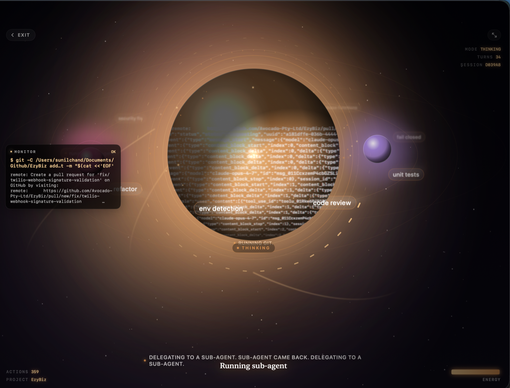

# Claudette

A native macOS front-end for [Claude Code](https://docs.claude.com/en/docs/claude-code) — the same agent, wrapped in a calm, video-like UI. Point it at any folder on your Mac and watch Claude work.



*Orb conversation mode: press any key to talk. The sphere refracts the actual Claude Code JSON stream inside; short "beats" narrate what Claude is doing right now; the MONITOR panel tails the current bash tool; idea satellites orbit the sphere with the tags Haiku pulled out of the turn; and each sub-agent Claude spawns pops out as its own small sphere with its own hue, then merges back on completion.*

## Why

Claude Code is powerful but its CLI is a wall of text. Claudette turns each run into something you can *skim*:

- **Every tool call is a distinct visual beat.** Read, Edit, Bash, Grep, WebFetch — each shows up as its own card with an icon, a human sentence, a live status pill, and an expandable body.
- **Edits play like a video.** When Claude edits a file, the card zooms in and reveals a real inline diff with green additions and red deletions. Multi-edit changes are stacked into a single card.
- **A narrator strip** at the bottom of the chat tells you what Claude is doing *right now* — "Reading src/foo.ts", "Editing package.json", "Running: npm test" — so you never lose the thread while responses stream.
- **Prose is prose.** Assistant text renders as serif Markdown with proper spacing, code fences, lists, quotes and inline code.
- **The whole app breathes** — spring transitions on new cards, gentle pulses on running actions, no jitter, no cognitive tax.
- **It can go out and look things up.** Claudette drives [browser-use](https://github.com/browser-use/browser-use) through a site in your own browser and comes back with what it found — on demand, or on a schedule you set. See [Browser tasks](#browser-tasks).

## Install

### From a release

Grab the latest `.dmg` from [Releases](https://github.com/Avocado-Pty-Ltd/Claudette/releases), open it, and drag **Claudette.app** onto the `/Applications` shortcut. First launch: right-click → **Open** — the build is ad-hoc signed rather than notarized, so Gatekeeper asks once.

Prefer a zip? `Claudette.app.zip` is attached to every release too — unzip and drop into `/Applications`.

Runtime dependency: Claudette drives the [Claude Code](https://docs.claude.com/en/docs/claude-code) CLI under the hood — it launches the `claude` binary and reads its stream-JSON output. Install Claude Code and sign in (`claude auth`) before first launch, or Claudette will surface a "could not find `claude` on your PATH" error the first time you send a message.

### From source

Requires macOS 15 (Sequoia) or newer, Xcode 16+ / Swift 6, and the [Claude Code](https://docs.claude.com/en/docs/claude-code) CLI installed and authenticated (`claude auth`).

```bash
git clone https://github.com/Avocado-Pty-Ltd/Claudette.git
cd Claudette
./build.sh
open build/Claudette.app       # or: cp -R build/Claudette.app /Applications/
```

## Anatomy of a chat

Each item in the timeline is one of:

| Kind             | Renders as                                                                                                     |
| ---------------- | -------------------------------------------------------------------------------------------------------------- |
| user message     | A right-aligned serif bubble                                                                                   |
| assistant text   | Left-aligned prose with Markdown, streaming dots while in flight                                               |
| thinking         | A collapsible "Thinking" line                                                                                  |
| **action card**  | Icon + title + status pill + `+adds −dels` chip, expands to reveal a diff, terminal card, or preformatted body |
| system notice    | A quiet info line                                                                                              |

### Action cards

Actions pair the `tool_use` event with its matching `tool_result` — you see one card per step, not two. Card styling by category:

- **Edit / MultiEdit** — auto-opens on completion with an LCS-based diff view (2-line context, added lines highlighted green, removed lines struck through in red).
- **Write** — same diff view against an empty original.
- **Bash** — terminal-style card with `$ command` on top and output below; error output tinted red.
- **Read** — file preview truncated to the first 24 lines.
- **Grep / Glob** — match list.
- **WebFetch** — URL + response body.
- **TodoWrite** — proper checklist with checkbox states.

Status pill goes from a pulsing "Working" → green "Done" → red "Error".

## Architecture

```
Sources/Claudette/
├── ClaudetteApp.swift           # @main + AppDelegate
├── Theme/Theme.swift            # design tokens
├── Models/
│   ├── Project.swift
│   └── TimelineItem.swift       # flat timeline: user/assistant/thinking/action/system
├── Services/
│   ├── ProjectStore.swift       # persists to ~/Library/Application Support/Claudette
│   ├── ClaudeCLIService.swift   # spawns `claude` with stream-json IO; pairs tool_use↔tool_result
│   ├── BrowserUseService.swift  # spawns the browser-use sidecar; parses its JSONL events
│   ├── RecipeStore.swift        # reads the user's own recipe files
│   ├── RecipeComposer.swift     # /recipe — has Claude write one
│   └── TaskScheduler.swift      # runs recipes at the times their files ask for
├── Resources/
│   └── browser_agent/
│       └── runner.py            # browser-use agent; knows nothing about any site
└── Views/
    ├── ContentView.swift        # NavigationSplitView + SessionHolder
    ├── Sidebar/                 # project list + add-project
    ├── Browser/
    │   ├── BrowserTaskPanel.swift  # recipe + goal → live trace → reviewable results
    │   ├── FindingCard.swift       # one result, editable drafts, copy + open
    │   └── RecipeComposerSheet.swift # describe it → review the JSON → save
    ├── Chat/
    │   ├── ChatView.swift       # main timeline scroller + activity ticker overlay
    │   ├── TimelineItemView.swift  # dispatcher + UserMessageView + AssistantTextView + ThinkingView + SystemNoticeView
    │   ├── ActionEventView.swift   # the action card
    │   ├── DiffView.swift          # LCS-based line diff
    │   ├── ActivityTicker.swift    # bottom narrator strip
    │   ├── MarkdownText.swift      # inline markdown renderer
    │   ├── CodeBlockView.swift
    │   └── InputBar.swift          # auto-growing NSTextView, ⌘⏎ / ⇧⏎
    └── Empty/EmptyStateView.swift
```

Claudette talks to the real `claude` binary via:

```
claude --print \
       --input-format stream-json \
       --output-format stream-json \
       --verbose \
       --permission-mode acceptEdits \
       --include-partial-messages \
       [--resume <last-session-id>]
```

with `cwd` set to the selected project folder. JSON events are parsed on the main actor:

- `system` → sets `session_id` and `cwd`
- `assistant` → each `text` finalizes the streaming text item; each `tool_use` appends an action item and marks it *active*
- `user` (echo) → matches `tool_result.tool_use_id` back to its action and updates status + result
- `stream_event` (partial) → appends text deltas to the current streaming assistant item
- `result` → finalizes streaming, clears active action

## Browser tasks

Press **⇧⌘B** (or type `/browse <goal>` in the chat box) and Claudette drives
[browser-use](https://github.com/browser-use/browser-use) through a site in your own
browser, then reports back: a card per result, why it matched, and any text you asked
it to draft — editable, with **Copy** and a link out to the page.

**Claudette ships no site-specific rules, and none belong in this repo.** The app knows
how to drive a browser and nothing about any particular website. Where to start, which
domains to stay on, what counts as a good result, what to draft and when to run all
live in JSON recipe files you write, kept outside the app:

```
~/Library/Application Support/Claudette/browser-recipes/*.json
```

Keep that folder in a private repo or a synced directory — your rules for your work
stay yours.

You don't have to write the JSON. `/recipe <what it should do>` (or **⇧⌘R**) has Claude
write it, and shows you the file before anything is saved:

```
/recipe watch the pricing pages of three competitors on example.com every Tuesday
        and Thursday morning and tell me anything that changed
```

It uses the Claude Code you're already signed into — no extra API key — and edits
afterwards are just edits to a file you own.

A recipe can also run itself:

```json
"schedule": { "days": ["tuesday", "thursday"], "at": "morning" }
```

Claudette is a desktop app, not a daemon: schedules fire while it's open, a missed slot
is skipped unless the recipe sets `catchUpIfMissed`, and nothing runs by itself until
you turn on the master switch in Settings. Each scheduled run writes its results to
`browser-runs/` and posts a notification.

Runs are **read-only by default**: the agent can search, filter and read, but can't
submit a form, post, send, or buy — which is what makes it safe to leave on a schedule.
That's enforced at the action level, not just in the prompt: every click and keystroke
passes a guard that refuses outbound controls and fails closed on anything it can't
identify.
Turn that off per-run for a task that genuinely needs to click through something. Check
the terms of any site you point it at; that call is yours, which is exactly why the
rules live in your file and not in Claudette.

Setup is three things in **Settings → Browser agent**: install browser-use (one click —
Claudette builds its own virtualenv), add an API key for the model that drives the
browser, and sign in to whatever sites you need, once, in the browser profile it
manages. Claudette never sees those passwords.

Full guide: [docs/browser-tasks.md](docs/browser-tasks.md).

## Keyboard shortcuts

| Shortcut | Action                    |
| -------- | ------------------------- |
| ⌘N       | Add project folder        |
| ⌘T       | Start a new chat          |
| ⇧⌘B      | Browser task              |
| ⇧⌘R      | New browser-task recipe   |
| ⌘⏎ / ⏎   | Send message              |
| ⇧⏎ / ⌥⏎  | Newline in the input      |

## Storage

Projects and their last session IDs live at:

```
~/Library/Application Support/Claudette/projects.json
```

Delete it to reset the app. Browser tasks add four more directories under the same
folder:

| Path | Holds |
| --- | --- |
| `browser-use-venv/` | The managed Python environment |
| `browser-profile/` | The browser profile with your site sign-ins |
| `browser-recipes/` | Your recipe files — yours to back up or version |
| `browser-runs/` | Markdown results from scheduled runs |

API keys live in the Keychain, not on disk.
